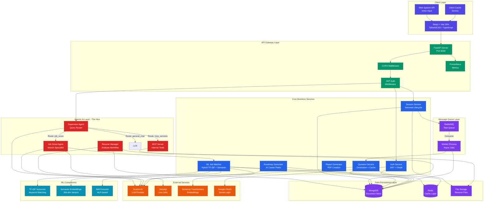
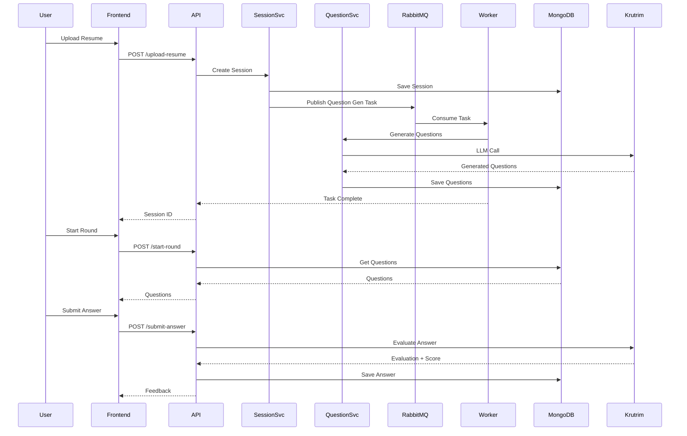
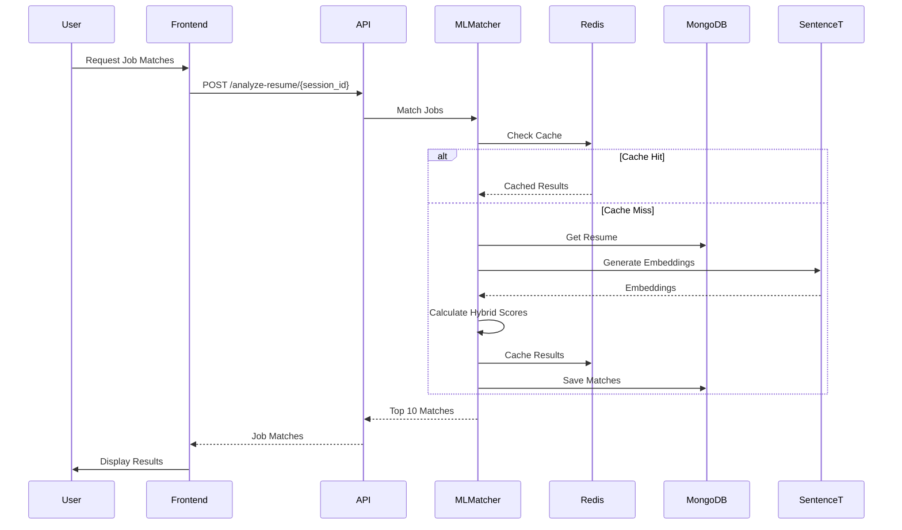
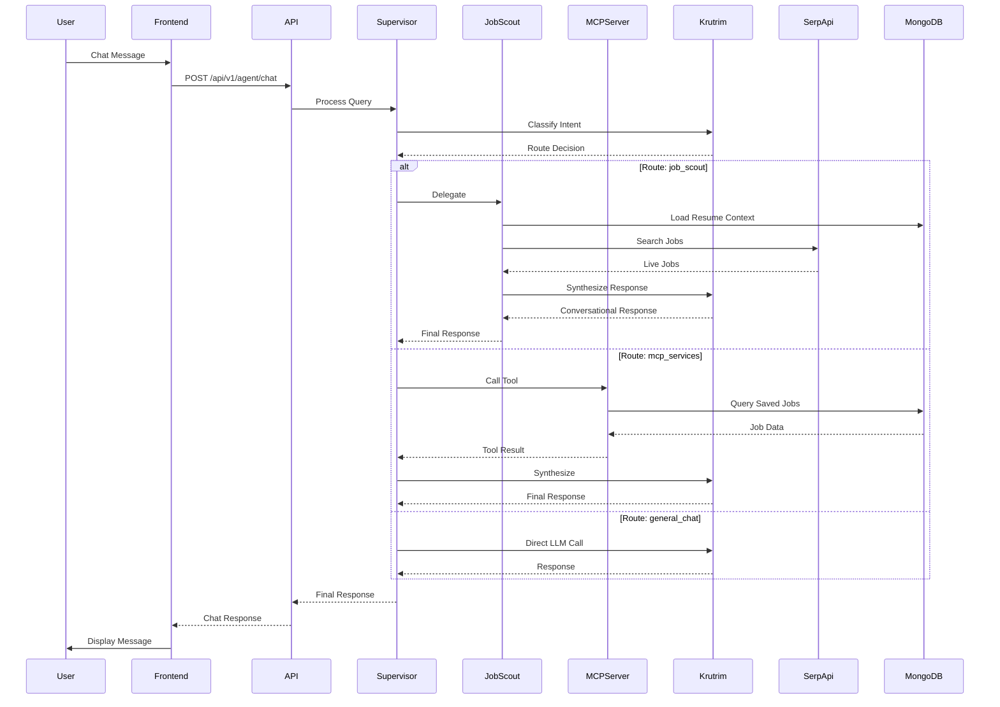
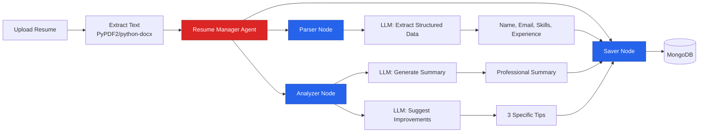
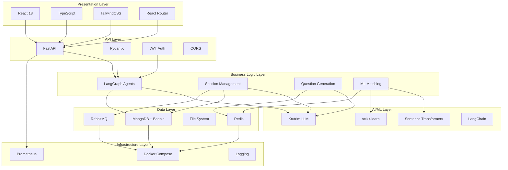
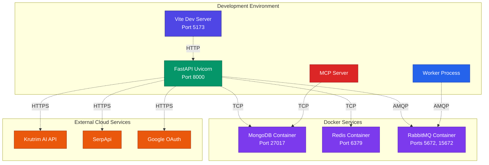

# CareerPath AI - System Architecture Diagram

## Complete System Architecture

## Data Flow Diagrams

### 1. Interview Session Flow

### 2. Job Matching Flow

### 3. Agentic AI Flow

### 4. Resume Analysis Flow

## Component Interaction Matrix

| Component | Interacts With | Purpose |
|-----------|----------------|---------|
| **Frontend** | FastAPI, Web Speech API | User interface, API calls, voice input |
| **FastAPI** | All Services, MongoDB, Redis | API gateway, routing, middleware |
| **Supervisor Agent** | Job Scout, MCP Server, Krutrim | Query routing, orchestration |
| **Job Scout Agent** | SerpApi, ML Matcher, Krutrim | Job search, result synthesis |
| **Resume Manager** | MongoDB, Krutrim | Resume parsing, analysis |
| **Session Service** | MongoDB, RabbitMQ, File Storage | Interview lifecycle management |
| **Question Service** | MongoDB, Redis, Krutrim | Question generation, caching |
| **ML Matcher** | MongoDB, Redis, Sentence Transformers | Hybrid job matching |
| **Worker** | RabbitMQ, Question Service, MongoDB | Async task processing |
| **MCP Server** | MongoDB | Internal tool exposure |

## Technology Stack Layers

## Deployment Architecture

---

**Legend**:
- 🔵 **Blue**: Frontend Components
- 🟢 **Green**: API Gateway
- 🔴 **Red**: Agentic AI
- 🔵 **Light Blue**: Business Services
- 🟣 **Purple**: Data Layer
- 🟠 **Orange**: External Services
- 🔷 **Cyan**: ML Components
