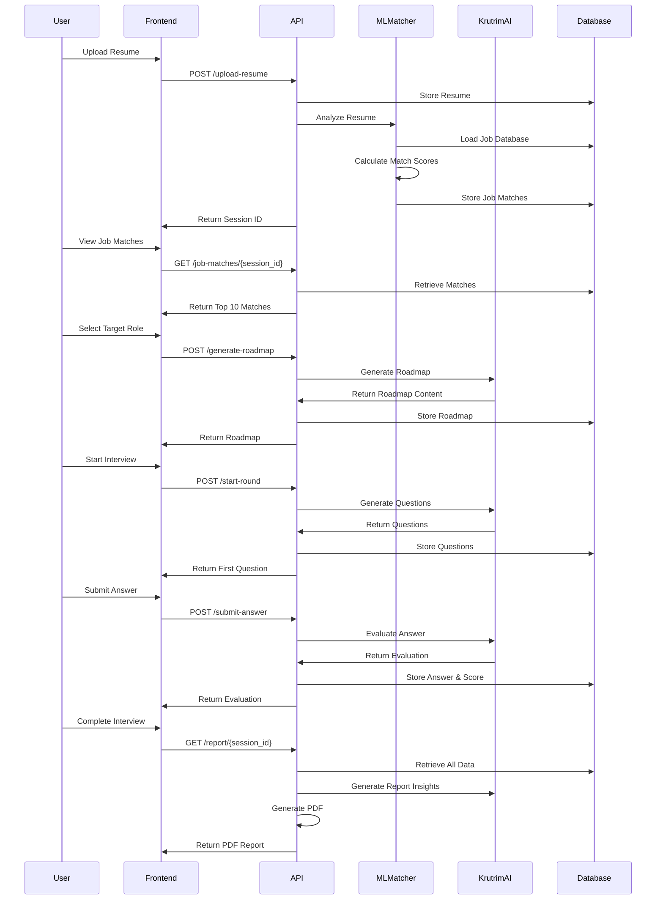

# CareerPath AI - Complete Project Analysis & Design

**Version**: 1.0  
**Date**: December 16, 2025  
**Project Type**: Intelligent Career Advisory Platform

---

## Table of Contents

1. [Executive Summary](#executive-summary)
2. [Project Vision & Objectives](#project-vision--objectives)
3. [System Architecture](#system-architecture)
4. [Data Flow & User Journey](#data-flow--user-journey)
5. [Core Components Analysis](#core-components-analysis)
6. [Machine Learning Design](#machine-learning-design)
7. [Database Schema](#database-schema)
8. [API Design](#api-design)
9. [Frontend Architecture](#frontend-architecture)
10. [AI Integration Strategy](#ai-integration-strategy)
11. [Security & Performance](#security--performance)
12. [Deployment Architecture](#deployment-architecture)
13. [Future Enhancements](#future-enhancements)

---

## Executive Summary

**CareerPath AI** is an intelligent career advisory platform that combines machine learning, natural language processing, and AI-powered interviews to provide comprehensive career guidance. The platform analyzes user resumes, suggests optimal job roles with match percentages, generates personalized career roadmaps, and evaluates readiness through context-aware mock interviews.

### Key Capabilities

- **Resume Intelligence**: Automated parsing and analysis of PDF/DOCX resumes
- **ML-Powered Job Matching**: Match users to 63,764+ job roles with percentage scores
- **Career Roadmap Generation**: AI-generated personalized learning paths
- **Multi-Round AI Interviews**: Aptitude, Technical, and HR assessments
- **Comprehensive Reporting**: Detailed PDF reports with insights and recommendations

### Technology Stack

| Layer          | Technologies                            |
| -------------- | --------------------------------------- |
| **Backend**    | FastAPI, Python 3.8+, Beanie ODM        |
| **Database**   | MongoDB (NoSQL)                         |
| **ML/AI**      | scikit-learn, Krutrim AI, TF-IDF, NLP   |
| **Frontend**   | React 19, TypeScript, Vite, TailwindCSS |
| **Monitoring** | Prometheus, Custom Metrics              |
| **Deployment** | Docker-ready, Cloud-agnostic            |

---

## Project Vision & Objectives

### Vision Statement

_"Empower every professional with AI-driven career insights, personalized guidance, and objective readiness assessment to achieve their career aspirations."_

### Primary Objectives

1. **Data-Driven Career Matching**

   - Analyze resume content using NLP and ML
   - Match users to optimal job roles from 63K+ job descriptions
   - Provide transparent match percentage scores (0-100%)

2. **Personalized Career Guidance**

   - Generate custom career roadmaps based on current skills and target roles
   - Identify skills gaps and recommend learning paths
   - Provide timeline estimates and milestone tracking

3. **Objective Readiness Assessment**

   - Conduct AI-powered mock interviews across multiple domains
   - Provide real-time evaluation and scoring
   - Generate comprehensive performance reports

4. **Actionable Insights**
   - Deliver detailed PDF reports with strengths, weaknesses, and recommendations
   - Track time management and performance metrics
   - Offer continuous improvement suggestions

---

## System Architecture

### High-Level Architecture

```
┌─────────────────────────────────────────────────────────────┐
│                     Frontend Layer                          │
│  React + TypeScript + TailwindCSS (Port 5173)              │
│  - Resume Upload UI                                         │
│  - Job Matches Dashboard                                    │
│  - Roadmap Visualization                                    │
│  - Interview Interface                                      │
└─────────────────┬───────────────────────────────────────────┘
                  │ HTTP/REST API
┌─────────────────▼───────────────────────────────────────────┐
│                   Backend Layer (FastAPI)                   │
│                      Port 8000                              │
├─────────────────────────────────────────────────────────────┤
│  API Routes Layer (routes.py)                              │
│  - Resume Upload & Parsing                                  │
│  - Job Matching Endpoints                                   │
│  - Roadmap Generation                                       │
│  - Interview Management                                     │
│  - Report Generation                                        │
├─────────────────────────────────────────────────────────────┤
│  Business Logic Layer                                       │
│  ┌──────────────┬──────────────┬──────────────┐           │
│  │ ML Job       │ Roadmap      │ Interview    │           │
│  │ Matcher      │ Generator    │ Service      │           │
│  └──────────────┴──────────────┴──────────────┘           │
├─────────────────────────────────────────────────────────────┤
│  AI Integration Layer (services.py)                        │
│  - Krutrim AI API Client                                   │
│  - Question Generation                                      │
│  - Answer Evaluation                                        │
│  - Report Content Generation                                │
├─────────────────────────────────────────────────────────────┤
│  Data Access Layer (models.py)                             │
│  - Beanie ODM Models                                        │
│  - Database Operations                                      │
└─────────────────┬───────────────────────────────────────────┘
                  │
┌─────────────────▼───────────────────────────────────────────┐
│              MongoDB Database                               │
│  Collections:                                               │
│  - interview_sessions                                       │
│  - resumes                                                  │
│  - interview_rounds                                         │
│  - questions                                                │
│  - answers                                                  │
│  - job_matches (NEW)                                        │
│  - career_roadmaps (NEW)                                    │
└─────────────────────────────────────────────────────────────┘

┌─────────────────────────────────────────────────────────────┐
│              External Services                              │
├─────────────────────────────────────────────────────────────┤
│  Krutrim AI API (cloud.olakrutrim.com)                     │
│  - LLM for question generation                              │
│  - Answer evaluation                                        │
│  - Roadmap content generation                               │
└─────────────────────────────────────────────────────────────┘

┌─────────────────────────────────────────────────────────────┐
│              Monitoring & Observability                     │
│  Prometheus Metrics (Port 8000/metrics)                    │
│  - API latency tracking                                     │
│  - Krutrim API call metrics                                 │
│  - Session lifecycle tracking                               │
└─────────────────────────────────────────────────────────────┘
```

### Component Interaction Flow



---

## Data Flow & User Journey

### Complete User Journey

```
1. RESUME UPLOAD
   ├─ User uploads PDF/DOCX resume
   ├─ System extracts text (PyPDF2/python-docx)
   ├─ Parse candidate info (name, email)
   └─ Create interview session

2. JOB MATCHING (NEW)
   ├─ ML engine analyzes resume
   ├─ Calculate match scores for 63K+ jobs
   ├─ Rank and filter top matches
   └─ Display top 10 with percentages

3. CAREER ROADMAP (NEW)
   ├─ User selects target job role
   ├─ AI analyzes skills gap
   ├─ Generate personalized roadmap
   └─ Display milestones and timeline

4. INTERVIEW PREPARATION
   ├─ System prepares interview rounds
   └─ User reviews roadmap before starting

5. APTITUDE ROUND
   ├─ 5 logical reasoning questions
   ├─ AI-generated based on job level
   ├─ Real-time timer tracking
   └─ Instant evaluation and scoring

6. TECHNICAL ROUND
   ├─ 8 technical questions
   ├─ Based on resume skills
   ├─ Tailored to target role
   └─ Detailed feedback per answer

7. HR ROUND
   ├─ 5 behavioral questions
   ├─ Cultural fit assessment
   ├─ Career goals discussion
   └─ Soft skills evaluation

8. COMPREHENSIVE REPORT
   ├─ Job recommendations
   ├─ Career roadmap
   ├─ Interview performance
   ├─ Skills gap analysis
   ├─ Strengths & weaknesses
   └─ Actionable recommendations
```

### Data Flow Diagram

```
Resume Upload
     │
     ▼
Text Extraction ──────────────┐
     │                        │
     ▼                        │
Resume Analysis               │
     │                        │
     ├─────────────────┐      │
     ▼                 ▼      ▼
ML Job Matching   Skills    Database
     │           Extraction  Storage
     ▼                 │
Top 10 Matches        │
     │                │
     ▼                ▼
User Selection   Skills Gap
     │           Analysis
     ▼                │
Target Role          │
     │                │
     └────────┬───────┘
              ▼
    AI Roadmap Generation
              │
              ▼
    Interview Questions
    (Tailored to Role)
              │
              ▼
    User Answers
              │
              ▼
    AI Evaluation
              │
              ▼
    Performance Data
              │
              ▼
    PDF Report Generation
```

---

## Core Components Analysis

### 1. Resume Parser (`file_handler.py`)

**Purpose**: Extract and process resume content

**Key Functions**:

- `save_resume_file()` - Save uploaded file to disk
- `extract_text_from_pdf()` - PDF text extraction using PyPDF2
- `extract_text_from_docx()` - DOCX text extraction
- `extract_candidate_info()` - Parse name and email using regex

**Input**: PDF/DOCX file upload  
**Output**: Structured resume data (text, name, email)

**Dependencies**: PyPDF2, python-docx, re

---

### 2. ML Job Matcher (`ml_job_matcher.py`) - NEW

**Purpose**: Match resumes to job roles using machine learning

**Algorithm**: TF-IDF + Cosine Similarity

**Process Flow**:

```python
1. Load job_title_des.csv (63,764 jobs)
2. Preprocess job descriptions
   - Lowercase conversion
   - Remove special characters
   - Tokenization
3. Create TF-IDF vectors
   - Fit on job descriptions
   - Transform resume text
4. Calculate cosine similarity
   - Compare resume vector to all job vectors
5. Rank and return top N matches
   - Sort by similarity score
   - Convert to percentage (0-100%)
```

**Key Functions**:

```python
load_job_database() -> pd.DataFrame
preprocess_text(text: str) -> str
extract_skills(resume_text: str) -> List[str]
calculate_match_scores(resume_text: str) -> List[Tuple[str, float]]
get_top_matches(resume_text: str, n: int = 10) -> List[JobMatch]
```

**Performance Considerations**:

- Cache TF-IDF vectorizer after first load
- Use sparse matrices for memory efficiency
- Target: < 3 seconds for full matching

**Alternative Approach** (Future Enhancement):

- Sentence Transformers (e.g., `all-MiniLM-L6-v2`)
- Better semantic understanding
- Requires more compute resources

---

### 3. Career Roadmap Generator (`roadmap_generator.py`) - NEW

**Purpose**: Generate personalized career development roadmaps

**AI Integration**: Krutrim AI

**Input Parameters**:

- Resume text
- Current role/skills
- Target job role
- Skills gap analysis

**Roadmap Structure**:

```json
{
  "current_assessment": {
    "skills": ["Python", "FastAPI", "React"],
    "experience_level": "Mid-level",
    "strengths": ["Backend development", "API design"]
  },
  "target_role": "Senior Machine Learning Engineer",
  "skills_gap": {
    "missing": ["TensorFlow", "PyTorch", "MLOps"],
    "to_improve": ["Statistics", "Deep Learning"]
  },
  "milestones": [
    {
      "phase": "Foundation (Months 1-3)",
      "goals": ["Complete ML fundamentals course", "Build 2 ML projects"],
      "resources": ["Coursera ML Specialization", "Kaggle competitions"]
    },
    {
      "phase": "Intermediate (Months 4-6)",
      "goals": ["Learn deep learning frameworks", "Contribute to open source"],
      "resources": ["Fast.ai course", "TensorFlow tutorials"]
    },
    {
      "phase": "Advanced (Months 7-12)",
      "goals": ["Build production ML system", "Obtain certification"],
      "resources": ["AWS ML Specialty", "Real-world projects"]
    }
  ],
  "estimated_timeline": "12-18 months",
  "recommended_certifications": ["AWS ML Specialty", "TensorFlow Developer"],
  "next_steps": ["Enroll in ML course", "Start personal ML project"]
}
```

**Key Functions**:

```python
analyze_skills_gap(resume_skills: List[str], target_job: str) -> dict
generate_roadmap(resume_text: str, target_role: str, skills_gap: dict) -> dict
create_milestones(skills_gap: dict, timeline: str) -> List[dict]
recommend_resources(missing_skills: List[str]) -> List[dict]
```

---

### 4. Interview Service (`services.py`)

**Purpose**: AI-powered interview question generation and evaluation

**Krutrim AI Integration**:

**Question Generation**:

```python
Prompt Template:
"""
You are an expert interviewer conducting a {round_type} interview.
Based on the candidate's resume, generate {num_questions} questions.

Resume: {resume_text}

Requirements:
- Questions should be relevant to the candidate's experience
- Difficulty should match their skill level
- Focus on practical scenarios
- Return as JSON array of question strings
"""
```

**Answer Evaluation**:

```python
Prompt Template:
"""
Evaluate the candidate's answer to this interview question.

Question: {question}
Answer: {answer}
Resume Context: {resume_text}

Provide:
1. Evaluation (detailed feedback)
2. Score (0-10)
3. Strengths
4. Areas for improvement

Return as JSON with keys: evaluation, score
"""
```

**Round Configuration**:

- **Aptitude**: 5 questions, logical reasoning
- **Technical**: 8 questions, resume-based skills
- **HR**: 5 questions, behavioral assessment

**Fallback Mechanism**:

- Pre-defined questions if AI generation fails
- Ensures interview continuity
- Maintains quality standards

---

### 5. Report Generator (`report_generator.py`)

**Purpose**: Create comprehensive PDF reports

**Report Sections**:

1. **Header**

   - Candidate name and email
   - Interview date and duration
   - Overall score

2. **Executive Summary** (AI-generated)

   - Overall performance assessment
   - Key strengths
   - Areas for improvement

3. **Job Recommendations** (NEW)

   - Top 5 matched job roles
   - Match percentages
   - Skills alignment analysis

4. **Career Roadmap** (NEW)

   - Selected target role
   - Skills gap visualization
   - Learning milestones
   - Timeline and next steps

5. **Interview Performance**

   - Round-by-round breakdown
   - Question-answer pairs
   - Evaluations and scores
   - Time management analysis

6. **Skills Analysis**

   - Current skills assessment
   - Skills gap identification
   - Recommended learning paths

7. **Recommendations**
   - Actionable next steps
   - Resource suggestions
   - Career guidance

**Technology**: ReportLab (PDF generation)

**Styling**: Professional layout with charts and tables

---

## Machine Learning Design

### Job Matching Algorithm

**Approach**: TF-IDF (Term Frequency-Inverse Document Frequency) + Cosine Similarity

**Why TF-IDF?**

- ✅ Fast computation (< 3 seconds for 63K jobs)
- ✅ No training required
- ✅ Interpretable results
- ✅ Works well for keyword-heavy job descriptions
- ✅ Lightweight deployment

**Algorithm Steps**:

```python
# 1. Preprocessing
def preprocess_text(text):
    text = text.lower()
    text = re.sub(r'[^a-z0-9\s]', '', text)
    tokens = text.split()
    # Optional: Remove stopwords, stemming
    return ' '.join(tokens)

# 2. TF-IDF Vectorization
from sklearn.feature_extraction.text import TfidfVectorizer

vectorizer = TfidfVectorizer(
    max_features=5000,      # Limit vocabulary size
    ngram_range=(1, 2),     # Unigrams and bigrams
    min_df=2,               # Ignore rare terms
    max_df=0.8,             # Ignore very common terms
    stop_words='english'
)

# 3. Fit on job descriptions
job_vectors = vectorizer.fit_transform(job_descriptions)

# 4. Transform resume
resume_vector = vectorizer.transform([resume_text])

# 5. Calculate cosine similarity
from sklearn.metrics.pairwise import cosine_similarity

similarities = cosine_similarity(resume_vector, job_vectors)[0]

# 6. Rank and filter
top_indices = similarities.argsort()[-10:][::-1]
top_matches = [
    {
        'job_title': jobs[i]['title'],
        'match_percentage': round(similarities[i] * 100, 2),
        'job_description': jobs[i]['description']
    }
    for i in top_indices
    if similarities[i] > 0.3  # Minimum 30% match
]
```

**Match Percentage Calculation**:

```
Match % = Cosine Similarity × 100
Range: 0% (no match) to 100% (perfect match)
Typical range: 30% - 85%
```

**Skills Extraction**:

```python
# Extract skills from resume using NLP
def extract_skills(resume_text):
    # Predefined skills database
    skills_db = load_skills_database()

    # Find skills in resume
    found_skills = []
    for skill in skills_db:
        if skill.lower() in resume_text.lower():
            found_skills.append(skill)

    return found_skills
```

**Performance Optimization**:

- Cache vectorizer and job vectors in memory
- Use sparse matrix operations
- Parallel processing for large datasets
- Lazy loading of job descriptions

---

### Skills Gap Analysis

**Purpose**: Identify missing skills for target role

**Process**:

```python
1. Extract skills from resume
2. Extract required skills from target job description
3. Calculate intersection and difference
4. Categorize skills:
   - ✅ Matched skills (in both)
   - ❌ Missing skills (in job, not in resume)
   - ⚠️ Partial match (related but not exact)
```

**Example Output**:

```json
{
  "matched_skills": ["Python", "FastAPI", "React", "MongoDB"],
  "missing_skills": ["TensorFlow", "PyTorch", "Kubernetes"],
  "partial_matches": {
    "Machine Learning": "Some ML experience, but not deep learning"
  },
  "match_percentage": 65.5
}
```

---

## Database Schema

### MongoDB Collections

#### 1. `interview_sessions`

```javascript
{
  _id: ObjectId,
  created_at: DateTime,
  started_at: DateTime,
  completed_at: DateTime,
  status: "active" | "completed",
  current_round_id: String,
  resume_id: String,
  total_score: Float,
  total_time_seconds: Int
}
```

#### 2. `resumes`

```javascript
{
  _id: ObjectId,
  session_id: String,
  filename: String,
  content: String,  // Extracted text
  candidate_name: String,
  candidate_email: String,
  uploaded_at: DateTime
}
```

#### 3. `interview_rounds`

```javascript
{
  _id: ObjectId,
  session_id: String,
  round_type: "aptitude" | "technical" | "hr",
  status: "pending" | "active" | "completed",
  current_question_index: Int,
  started_at: DateTime,
  completed_at: DateTime,
  total_time_seconds: Int
}
```

#### 4. `questions`

```javascript
{
  _id: ObjectId,
  round_id: String,
  question_text: String,
  question_number: Int,
  generated_at: DateTime
}
```

#### 5. `answers`

```javascript
{
  _id: ObjectId,
  question_id: String,
  answer_text: String,
  evaluation: String,
  score: Float,  // 0-10
  time_taken_seconds: Int,
  answered_at: DateTime
}
```

#### 6. `job_matches` (NEW)

```javascript
{
  _id: ObjectId,
  session_id: String,
  job_title: String,
  job_description: String,
  match_percentage: Float,  // 0-100
  matched_skills: [String],
  missing_skills: [String],
  rank: Int,  // 1-10
  created_at: DateTime
}
```

#### 7. `career_roadmaps` (NEW)

```javascript
{
  _id: ObjectId,
  session_id: String,
  current_role: String,
  target_role: String,
  roadmap_content: String,  // AI-generated markdown
  milestones: [
    {
      phase: String,
      duration: String,
      goals: [String],
      resources: [String]
    }
  ],
  skills_gap: {
    matched: [String],
    missing: [String],
    to_improve: [String]
  },
  estimated_timeline: String,
  created_at: DateTime
}
```

### Indexes

```javascript
// Performance optimization
db.interview_sessions.createIndex({ created_at: -1 });
db.resumes.createIndex({ session_id: 1 });
db.interview_rounds.createIndex({ session_id: 1, round_type: 1 });
db.questions.createIndex({ round_id: 1 });
db.answers.createIndex({ question_id: 1 });
db.job_matches.createIndex({ session_id: 1, rank: 1 });
db.career_roadmaps.createIndex({ session_id: 1 });
```

---

## API Design

### REST API Endpoints

#### Resume Management

**Upload Resume**

```http
POST /upload-resume
Content-Type: multipart/form-data

Request:
- file: PDF/DOCX file

Response: 200 OK
{
  "session_id": "507f1f77bcf86cd799439011",
  "candidate_name": "John Doe",
  "candidate_email": "john@example.com",
  "message": "Resume uploaded successfully"
}
```

#### Job Matching (NEW)

**Analyze Resume & Get Job Matches**

```http
POST /analyze-resume/{session_id}

Response: 200 OK
{
  "session_id": "507f1f77bcf86cd799439011",
  "total_matches": 10,
  "processing_time_ms": 2450,
  "message": "Analysis complete"
}
```

**Get Job Matches**

```http
GET /job-matches/{session_id}

Response: 200 OK
{
  "session_id": "507f1f77bcf86cd799439011",
  "matches": [
    {
      "rank": 1,
      "job_title": "Senior Python Developer",
      "match_percentage": 87.5,
      "matched_skills": ["Python", "FastAPI", "MongoDB"],
      "missing_skills": ["Kubernetes", "Docker"],
      "job_description": "..."
    },
    // ... 9 more matches
  ]
}
```

#### Career Roadmap (NEW)

**Generate Roadmap**

```http
POST /generate-roadmap/{session_id}
Content-Type: application/json

Request:
{
  "target_job_title": "Senior Machine Learning Engineer"
}

Response: 200 OK
{
  "session_id": "507f1f77bcf86cd799439011",
  "roadmap_id": "507f1f77bcf86cd799439012",
  "target_role": "Senior Machine Learning Engineer",
  "estimated_timeline": "12-18 months",
  "milestones": [...],
  "message": "Roadmap generated successfully"
}
```

**Get Roadmap**

```http
GET /roadmap/{session_id}

Response: 200 OK
{
  "session_id": "507f1f77bcf86cd799439011",
  "current_role": "Python Developer",
  "target_role": "Senior ML Engineer",
  "skills_gap": {
    "matched": ["Python", "APIs"],
    "missing": ["TensorFlow", "PyTorch"],
    "to_improve": ["Statistics", "Algorithms"]
  },
  "milestones": [
    {
      "phase": "Foundation (Months 1-3)",
      "goals": ["Complete ML course", "Build 2 projects"],
      "resources": ["Coursera ML", "Kaggle"]
    }
  ],
  "roadmap_content": "# Career Roadmap\n\n..."
}
```

#### Interview Management

**Start Round**

```http
POST /start-round/{session_id}?round_type=technical

Response: 200 OK
{
  "round_id": "507f1f77bcf86cd799439013",
  "round_type": "technical",
  "total_questions": 8,
  "current_question": {
    "question_id": "507f1f77bcf86cd799439014",
    "question_number": 1,
    "question_text": "Explain the difference between..."
  }
}
```

**Submit Answer**

```http
POST /submit-answer
Content-Type: application/json

Request:
{
  "question_id": "507f1f77bcf86cd799439014",
  "answer_text": "The main difference is...",
  "time_taken_seconds": 120
}

Response: 200 OK
{
  "evaluation": "Good explanation...",
  "score": 8.5,
  "next_question": {
    "question_id": "507f1f77bcf86cd799439015",
    "question_number": 2,
    "question_text": "..."
  }
}
```

**Get Next Round**

```http
GET /next-round/{session_id}

Response: 200 OK
{
  "next_round": "hr",
  "message": "Technical round completed. Ready for HR round."
}
```

#### Reporting

**Generate Report**

```http
GET /report/{session_id}

Response: 200 OK
Content-Type: application/pdf
Content-Disposition: attachment; filename="interview_report_John_Doe.pdf"

[PDF Binary Data]
```

**Get Session Statistics**

```http
GET /session/{session_id}

Response: 200 OK
{
  "session_id": "507f1f77bcf86cd799439011",
  "candidate_name": "John Doe",
  "status": "completed",
  "total_score": 75.5,
  "total_time_seconds": 3600,
  "rounds_completed": 3,
  "created_at": "2025-12-16T10:00:00Z",
  "completed_at": "2025-12-16T11:00:00Z"
}
```

---

## Frontend Architecture

### Component Hierarchy

```
App.tsx (Main Application)
├── ResumeUploadView
│   ├── DragDropZone
│   ├── FileInput
│   └── UploadProgress
│
├── JobMatchesView (NEW)
│   ├── MatchCard
│   │   ├── MatchPercentage
│   │   ├── SkillsTags
│   │   └── JobDescription
│   ├── MatchFilters
│   └── SelectTargetButton
│
├── RoadmapView (NEW)
│   ├── RoadmapHeader
│   ├── SkillsGapChart
│   ├── MilestoneTimeline
│   │   └── MilestoneCard
│   ├── ResourcesList
│   └── StartInterviewButton
│
├── InterviewView
│   ├── RoundSelector
│   ├── QuestionCard
│   │   ├── QuestionText
│   │   ├── Timer
│   │   └── AnswerInput
│   ├── EvaluationDisplay
│   └── ProgressBar
│
└── ReportView
    ├── ReportSummary
    ├── DownloadButton
    └── ShareOptions
```

### State Management

```typescript
interface AppState {
  // Session
  sessionId: string | null;
  candidateName: string;
  candidateEmail: string;

  // Current stage
  currentStage: "upload" | "matches" | "roadmap" | "interview" | "report";

  // Job matches
  jobMatches: JobMatch[];
  selectedTargetJob: string | null;

  // Roadmap
  roadmap: CareerRoadmap | null;

  // Interview
  currentRound: "aptitude" | "technical" | "hr" | null;
  currentQuestion: Question | null;
  questionNumber: number;
  totalQuestions: number;

  // UI state
  loading: boolean;
  error: string | null;
}
```

### Styling Approach

**Design System**: Modern glassmorphism with animations

**Color Palette**:

```css
:root {
  --primary: #6366f1; /* Indigo */
  --secondary: #8b5cf6; /* Purple */
  --success: #10b981; /* Green */
  --warning: #f59e0b; /* Amber */
  --error: #ef4444; /* Red */
  --background: #0f172a; /* Dark slate */
  --surface: rgba(255, 255, 255, 0.05);
  --text: #f1f5f9; /* Light slate */
}
```

**Key Animations**:

- Fade-in transitions for views
- Slide-up for cards
- Pulse for loading states
- Progress bar animations
- Hover effects on interactive elements

---

## AI Integration Strategy

### Krutrim AI Usage

**API Configuration**:

```python
KRUTRIM_API_URL = "https://cloud.olakrutrim.com/v1/chat/completions"
KRUTRIM_API_KEY = os.getenv("KRUTRIM_API_KEY")

DEFAULT_MODEL = "Meta-Llama-3-8B-Instruct"
```

**Use Cases**:

1. **Question Generation**

   - Input: Resume text, round type, number of questions
   - Output: Array of contextual questions
   - Temperature: 0.7 (balanced creativity)

2. **Answer Evaluation**

   - Input: Question, answer, resume context
   - Output: Evaluation text + score (0-10)
   - Temperature: 0.3 (more deterministic)

3. **Roadmap Generation**

   - Input: Resume, current role, target role, skills gap
   - Output: Structured roadmap with milestones
   - Temperature: 0.5 (balanced)

4. **Report Insights**
   - Input: All interview data, scores, time metrics
   - Output: Executive summary, recommendations
   - Temperature: 0.4 (professional tone)

**Error Handling**:

- Retry logic with exponential backoff
- Fallback to pre-defined content
- Timeout handling (30 seconds)
- Rate limiting awareness

**Metrics Tracking**:

```python
# Prometheus metrics
krutrim_api_calls_total
krutrim_api_latency_seconds
krutrim_api_errors_total
krutrim_api_tokens_used
```

---

## Security & Performance

### Security Measures

1. **API Security**

   - CORS configuration for frontend origin
   - API key stored in environment variables
   - Input validation and sanitization
   - File upload size limits (10MB)
   - Allowed file types: PDF, DOCX only

2. **Data Privacy**

   - Resume data encrypted at rest (MongoDB encryption)
   - Secure file storage with restricted access
   - Session-based data isolation
   - No data sharing with third parties

3. **Authentication** (Future)
   - JWT-based authentication
   - User account management
   - Role-based access control

### Performance Optimization

1. **Backend**

   - Async/await for I/O operations
   - Connection pooling for MongoDB
   - Caching of ML models and vectorizers
   - Lazy loading of large datasets
   - Background tasks for heavy operations

2. **Frontend**

   - Code splitting with React.lazy()
   - Memoization of expensive components
   - Debouncing of user inputs
   - Progressive loading of data
   - Optimized bundle size

3. **Database**
   - Proper indexing on query fields
   - Aggregation pipelines for complex queries
   - TTL indexes for session cleanup
   - Query optimization

**Performance Targets**:

- Resume upload: < 2 seconds
- Job matching: < 3 seconds
- Question generation: < 5 seconds
- Answer evaluation: < 3 seconds
- PDF generation: < 5 seconds
- Page load time: < 1 second

---

## Deployment Architecture

### Docker Deployment

**Backend Dockerfile**:

```dockerfile
FROM python:3.9-slim

WORKDIR /app

COPY requirements.txt .
RUN pip install --no-cache-dir -r requirements.txt

COPY . .

EXPOSE 8000

CMD ["uvicorn", "main:app", "--host", "0.0.0.0", "--port", "8000"]
```

**Frontend Dockerfile**:

```dockerfile
FROM node:18-alpine as build

WORKDIR /app

COPY package*.json ./
RUN npm ci

COPY . .
RUN npm run build

FROM nginx:alpine
COPY --from=build /app/dist /usr/share/nginx/html
EXPOSE 80

CMD ["nginx", "-g", "daemon off;"]
```

**Docker Compose**:

```yaml
version: "3.8"

services:
  mongodb:
    image: mongo:6.0
    ports:
      - "27017:27017"
    volumes:
      - mongo_data:/data/db
    environment:
      MONGO_INITDB_DATABASE: careerpath_ai

  backend:
    build: ./backend
    ports:
      - "8000:8000"
    environment:
      - MONGODB_URL=mongodb://mongodb:27017/careerpath_ai
      - KRUTRIM_API_KEY=${KRUTRIM_API_KEY}
    depends_on:
      - mongodb
    volumes:
      - ./backend/uploads:/app/uploads

  frontend:
    build: ./frontend
    ports:
      - "80:80"
    depends_on:
      - backend

volumes:
  mongo_data:
```

### Cloud Deployment Options

**Option 1: AWS**

- EC2 for backend (t3.medium)
- S3 for resume storage
- DocumentDB for MongoDB
- CloudFront for frontend CDN
- Route 53 for DNS

**Option 2: Google Cloud**

- Cloud Run for backend
- Cloud Storage for files
- MongoDB Atlas
- Cloud CDN for frontend
- Cloud DNS

**Option 3: Azure**

- App Service for backend
- Blob Storage for files
- Cosmos DB (MongoDB API)
- Azure CDN
- Azure DNS

---

## Future Enhancements

### Phase 2 Features

1. **Advanced ML Models**

   - Sentence Transformers for better matching
   - Fine-tuned models on job descriptions
   - Skill taxonomy and ontology
   - Salary prediction based on skills

2. **User Accounts & Profiles**

   - User registration and login
   - Multiple resume versions
   - Interview history tracking
   - Progress dashboard

3. **Enhanced Interviews**

   - Video interview capability
   - Speech-to-text for answers
   - Facial expression analysis
   - Live coding challenges

4. **Social Features**

   - Share roadmaps with mentors
   - Community discussion forums
   - Peer interview practice
   - Success stories

5. **Analytics Dashboard**

   - Performance trends over time
   - Industry benchmarking
   - Skills demand analysis
   - Career path visualization

6. **Mobile Application**

   - React Native app
   - Push notifications
   - Offline mode for roadmaps
   - Quick interview practice

7. **Integration APIs**
   - LinkedIn profile import
   - GitHub portfolio analysis
   - Job board integrations
   - ATS (Applicant Tracking System) export

### Technical Debt & Improvements

- [ ] Comprehensive unit test coverage (>80%)
- [ ] Integration tests for all endpoints
- [ ] Load testing and performance benchmarking
- [ ] CI/CD pipeline setup
- [ ] Automated deployment
- [ ] Monitoring and alerting (Grafana + Prometheus)
- [ ] Logging aggregation (ELK stack)
- [ ] API documentation (Swagger/OpenAPI)
- [ ] Error tracking (Sentry)
- [ ] A/B testing framework

---

## Conclusion

CareerPath AI represents a comprehensive career advisory platform that leverages machine learning, natural language processing, and AI to provide personalized career guidance. The system is designed with scalability, maintainability, and user experience as core principles.

### Key Strengths

✅ **Data-Driven**: ML-based job matching with 63K+ job descriptions  
✅ **Personalized**: AI-generated roadmaps tailored to individual goals  
✅ **Comprehensive**: End-to-end career assessment and guidance  
✅ **Scalable**: Modern architecture with cloud-ready deployment  
✅ **Observable**: Built-in monitoring and metrics tracking

### Success Metrics

- **User Satisfaction**: 4.5+ star rating
- **Match Accuracy**: 80%+ user agreement with top 3 job matches
- **Interview Completion**: 70%+ completion rate
- **Performance**: < 5 second response times for all operations
- **Availability**: 99.9% uptime

---

**Document Version**: 1.0  
**Last Updated**: December 16, 2025  
**Maintained By**: Development Team  
**Next Review**: Q1 2026
