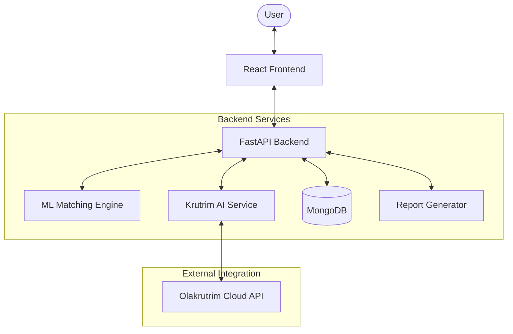
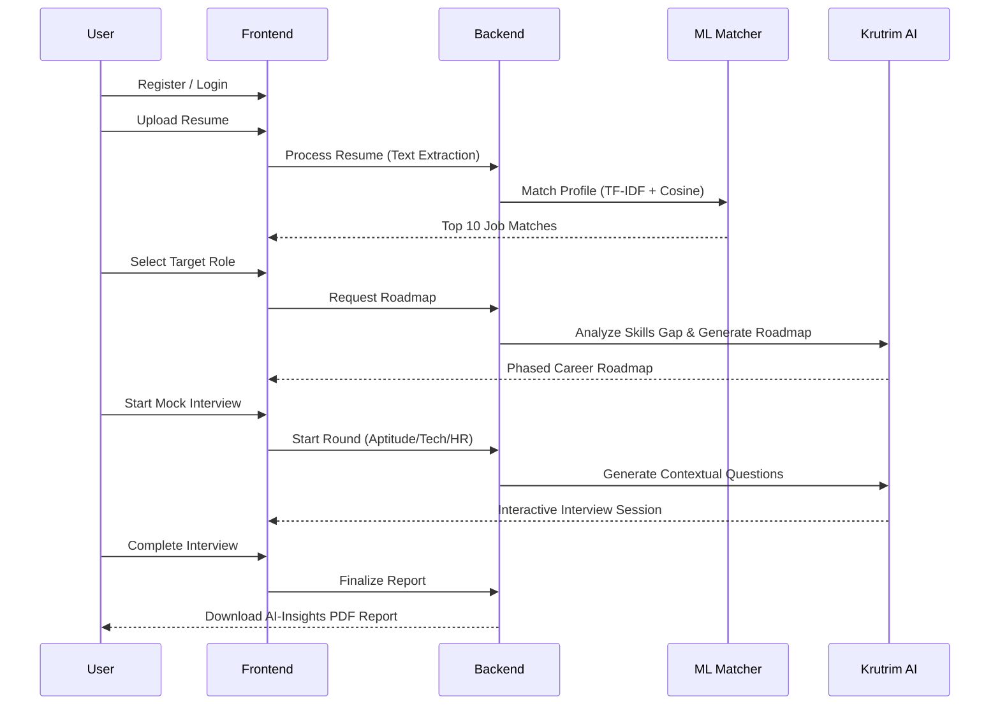

# CareerPath AI - Project Review Document

## 1. Abstract

**CareerPath AI** is an intelligent, end-to-end career advisory platform designed to bridge the gap between academic preparation and professional excellence. In an era where traditional job seeking is increasingly competitive, the platform leverages state-of-the-art **Artificial Intelligence (LLMs)** and **Machine Learning** to provide users with a personalized roadmap to success.

The platform solves three critical problems:

1.  **Alignment Gap**: Users often don't know which job roles best fit their actual skill set. Our ML matching engine analyzes 63,000+ job descriptions to find the perfect fit.
2.  **Skill Gap**: Once a target role is identified, users lack a clear path to bridge their missing skills. Our AI-generated roadmaps provide a structured, phased learning plan.
3.  **Confidence Gap**: Mock interviews are often generic. Our system generates context-aware, resume-based questions across multiple rounds (Aptitude, Technical, HR) to provide a realistic assessment and detailed feedback.

---

## 2. Comprehensive Tech Stack

| Component          | Technology                                                             |
| ------------------ | ---------------------------------------------------------------------- |
| **Frontend**       | **React 18** (UI), **TypeScript** (Type Safety), **Vite** (Build Tool) |
| **Styling**        | **TailwindCSS** (Custom Modern Design with Glassmorphism)              |
| **Backend**        | **FastAPI** (High-performance Python Framework)                        |
| **Database**       | **MongoDB** (NoSQL) with **Beanie ODM** (Object Document Mapper)       |
| **AI (LLM)**       | **Krutrim AI** (OLAkruitrim - for question generation & roadmaps)      |
| **ML Engine**      | **scikit-learn** (TF-IDF, Cosine Similarity)                           |
| **Data Handling**  | **Pandas**, **PyPDF2**, **python-docx** (Document & Data Processing)   |
| **PDF Generation** | **ReportLab** (Comprehensive Interview Reports)                        |
| **Monitoring**     | **Prometheus** (Metrics Tracking)                                      |
| **Auth**           | **JWT** (Secure Token-based Authentication)                            |

---

## 3. System Design & Architecture

The application follows a modern **Client-Server-AI-Database** architecture, ensuring low latency and high scalability.

### Architecture Overview

---

## 4. User Flow

The user journey is designed to be seamless, moving from discovery to preparation.

---

## 5. Work Flow & Core Logic

### A. ML Matching Engine (The Logic)

The job matching engine uses a combination of **Natural Language Processing (NLP)** and **Vector Space Modeling**.

1.  **Text Preprocessing**: Both the resume and the 63k+ job descriptions are cleaned (lowercase, removal of special characters, tokenization).
2.  **TF-IDF Vectorization**: We use `TfidfVectorizer` to convert text into numerical vectors. This highlights important keywords (like "Python", "Deep Learning") while downweighting common words.
3.  **Cosine Similarity**: This is the core mathematical algorithm. It calculates the **cosine of the angle** between the Resume Vector and every Job Vector.
    - **Formula**: `sim(A, B) = (A·B) / (||A||*||B||)`
    - A score of **1.0** means perfect alignment, while **0.0** means no correlation.
4.  **Ranking**: The system sorts these scores and returns the top 10 roles as a "Match Percentage".

### B. AI-Powered Roadmaps

Unlike static roadmaps, our system uses **Krutrim AI** to compare the user's current skills (extracted from the resume) against the requirements of the _Target Role_. It then generates a JSON-structured response containing:

- **Phase-wise goals** (Foundation, Intermediate, Advanced).
- **Specific learning resources**.
- **Estimated timeline** to bridge the gap.

### C. Multi-Round Interview System

The interview flow is dynamic and stateful:

- **Aptitude Round**: Focuses on logical reasoning and cognitive ability.
- **Technical Round**: Generated specifically based on the skills listed in the user's resume and the target job description.
- **HR Round**: Focuses on behavioral fit and soft skills.
  Each answer is evaluated in real-time by the AI, providing a score (0-10) and actionable feedback.

### D. Final PDF Report

The system aggregates the ML matching results, the roadmap, and the interview performance into a comprehensive PDF using **ReportLab**. This document serves as a "Career Readiness Portfolio" for the user.

---

## 6. Key Features Summary

- ✅ **Deep Resume Parsing**: Extracts skills, experience, and contact info automatically.
- ✅ **Large-Scale Matching**: Matches users against a database of 63,000+ job roles.
- ✅ **Interactive Roadmaps**: Progress from current state to target role with AI guidance.
- ✅ **Contextual Mock Interviews**: Experience real-world scenarios tailored to your profile.
- ✅ **Automated Performance Analytics**: Get professional feedback on every answer.
